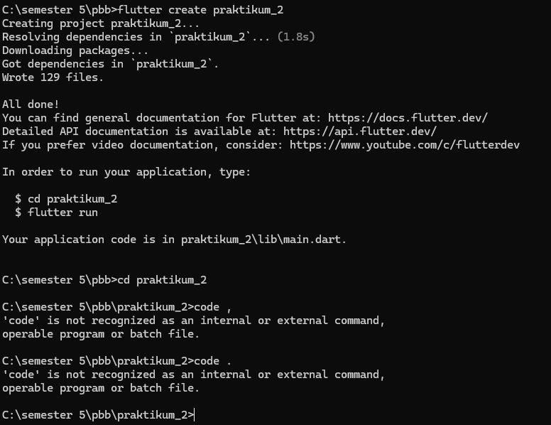
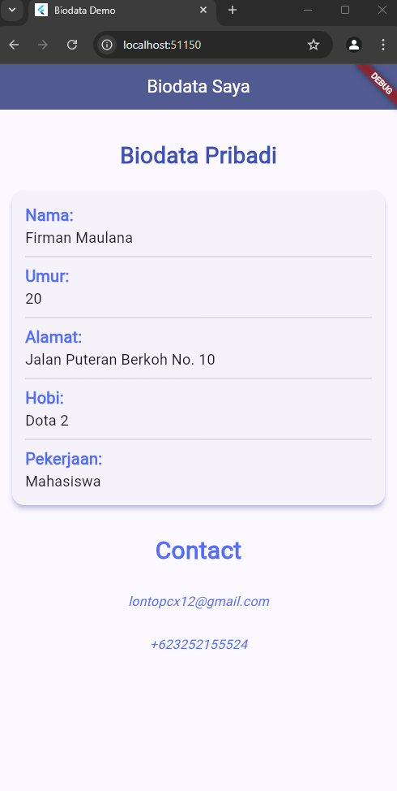

**LAPORAN PRAKTIKUM**  
**PEMOGRAMAN PERANGKAT BERGERAK**  
**MODUL 2**  

Disusun Oleh: 
Firman Maulanaa 
2211104083 
S1SE-06-02 
 
 

**PRODI S1 REKAYASA PERANGKAT LUNAK**  
**FAKULTAS INFORMATIKA**  
**TELKOM UNIVERSITY PURWOKERTO**  
**2024**  

---

<h1>Tugas Praktikum 2 </h1>

# PPB_FIRMAN MAULANA_2211104083_SE-06-C/02_Pengenalan_Flutter/LP_02

<li> Nama   : Firman Maulana
<li> NIM    : 2211104083
<li> Kelas  : SE-06-02

## 1. Jelaskan apa itu Dart & Flutter beserta contoh widget yang ada pada Flutter

<li>Dart adalah bahasa pemrograman yang dikembangkan oleh Google, dirancang untuk membangun aplikasi front-end yang modern dan cepat. Dart adalah bahasa yang berbasis object-oriented, dengan sintaks yang mirip dengan C-style (seperti JavaScript, Java, atau C#), dan mendukung pemrograman asinkron</li>
<li>Flutter adalah framework open-source yang juga dikembangkan oleh Google untuk membangun aplikasi yang berjalan di berbagai platform (iOS, Android, web, dan desktop) menggunakan satu basis kode. Flutter menggunakan Dart sebagai bahasa pemrograman utamanya. Framework ini terkenal dengan performa tinggi dan kemampuan rendering UI yang fleksibel dan indah</li>

## Contoh Widget di Flutter
contoh widget yang sering digunakan:

  <li>Text:Digunakan untuk menampilkan teks di aplikasi.</li>
  <li>Container: Widget yang paling sering digunakan untuk membuat layout di Flutter, sering digunakan untuk membuat kotak dengan margin, padding, atau dekorasi.</li>
  <li>Column : Menyusun anak-anak widget secara vertikal.</li>
  <li>Scaffold: Struktur dasar untuk aplikasi, seperti menambahkan AppBar, Drawer, dan FloatingActionButton.</li>

   
  
## 2. Buatlah sebuah project Flutter

 

## 3. Setelah project dibuat, jalankan di emulator atau pada real device (jika pada tampilan telah keluar project Flutter seperti gambar di bawah, maka telah berhasil).

 

## 4. Setelah berhasil, modifikasi halaman diatas untuk menampilkan biodata kalian, minimal 5 widget!! (bebas, buatlah sekreatif mungkin).

