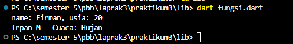
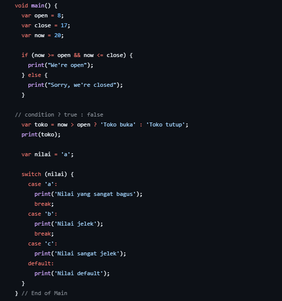
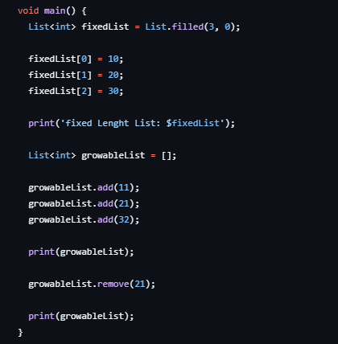
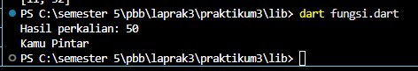

<div align="center">

**LAPORAN PRAKTIKUM**  
**PEMROGRAMAN PERANGKAT BERGERAK**

**MODUL 3**  
**PENGENALAN DART**


Disusun Oleh :

**FIRMAN MAULANA 2211104083**  
**SE06-02**

Asisten Praktikum :  
Mas Faza  
Mba Hasna

Dosen Pengampu :  
Yudha Islami Sulistya, S.Kom., M.Cs

PROGRAM STUDI S1 REKAYASA PERANGKAT LUNAK  
FAKULTAS INFORMATIKA  
TELKOM UNIVERSITY PURWOKERTO  
2024

</div>

---

# GUIDED

## A. Variabel
Pada bagian ini, kita belajar tentang cara mendeklarasikan dan menginisialisasi variabel di Dart. Dalam contoh ini, variabel `name` dan `age` digunakan untuk menyimpan nama dan usia. Selain itu, kita juga mendeklarasikan dua variabel `firstName` dan `lastName`, yang kemudian digabungkan dan dicetak bersama variabel cuaca.

**Input**
```dart
void main() {
  var name = "Firman";
  var age = "20";
  print("name: $name, usia: $age");

  String firstName, lastName; 
  firstName = "Firman";
  lastName = "M";
  final cuaca = "Hujan";

  print("$firstName $lastName - Cuaca: $cuaca");
}
```

**Output**




---

## B. Statement Control
Bagian ini memperkenalkan kontrol alur program menggunakan `if-else`, operator ternary, dan `switch-case`. Pada kode ini, program mengecek apakah waktu sekarang (`now`) berada di antara waktu buka (`open`) dan tutup (`close`). Selain itu, penggunaan `switch` memungkinkan pengecekan beberapa kasus pada variabel `nilai`.

**Input**
```dart
void main() {
  var open = 8;
  var close = 17;
  var now = 20;

  if (now >= open && now <= close) {
    print("We're open");
  } else {
    print("Sorry, we're closed");
  }

  var toko = now > open ? 'Toko buka' : 'Toko tutup';
  print(toko);

  var nilai = 'a';

  switch (nilai) {
    case 'a':
      print('Nilai yang sangat bagus');
      break;
    case 'b':
      print('Nilai jelek');
      break;
    case 'c':
      print('Nilai sangat jelek');
    default:
      print('Nilai default');
  }
}
```

**Output**



---

## C. Loop
Di sini kita mempelajari dua jenis loop, yaitu `for` dan `while`. Loop `for` akan mengulang dari 0 hingga kurang dari 5, sedangkan loop `while` akan terus mengulang sampai kondisi terpenuhi (dalam hal ini, sampai nilai `i` lebih besar dari 5).

**Input**
```dart
void main () {
  for (int i = 0; i < 5; i++) {
    print(i);
  }

  int i = 1;
  while (i <= 5) {
    print('Angka: $i');
    i++;
  }
}
```

**Output**


---

## D. List
Pada bagian ini, kita belajar tentang tipe data `List` di Dart. Ada dua jenis list yang diperkenalkan: list dengan panjang tetap (`fixedList`) dan list yang dapat diubah ukurannya (`growableList`). Pada kode ini, kita melihat bagaimana cara menambah dan menghapus elemen dari list.

**Input**
```dart
void main() {
  List<int> fixedList = List.filled(3, 0);

  fixedList[0] = 10;
  fixedList[1] = 20;
  fixedList[2] = 30;

  print('fixed Length List: $fixedList');

  List<int> growableList = [];

  growableList.add(11);
  growableList.add(21);
  growableList.add(32);

  print(growableList);

  growableList.remove(21);

  print(growableList);
}
```

**Output**




---

## E. Fungsi
Fungsi adalah blok kode yang dapat dipanggil untuk menjalankan tugas tertentu. Pada contoh ini, terdapat dua fungsi: `cetakPesan` untuk mencetak sebuah pesan, dan `perkalian` untuk mengembalikan hasil perkalian dua angka.

**Input**
```dart
void cetakPesan(String pesan) {
  print(pesan); // Mencetak pesan
}

int perkalian(int a, int b) {
  return a * b; // Mengembalikan nilai perkalian
}

void main () {
  int hasil = perkalian(5, 10);
  print("Hasil perkalian: $hasil");

  cetakPesan("Kamu Pintar");
}
```

**Output**



# UNGUIDED

## A. Tugas Percabangan (Branching )
Soal:
Buatlah sebuah fungsi dalam Dart yang menerima sebuah nilai dari user, lalu melakukan
percabangan untuk memberikan output berdasarkan kondisi berikut:
Deskripsi :
* Jika nilai lebih besar dari 70, program harus mereturn "Nilai A".
* Jika nilai lebih besar dari 40 tetapi kurang atau sama dengan 70, program harus
mereturn "Nilai B".
* Jika nilai lebih besar dari 0 tetapi kurang atau sama dengan 40, program harus
mereturn "Nilai C".
d. Jika nilai tidak memenuhi semua kondisi di atas, program harus mereturn teks
kosong.

**Input**
```dart
import 'dart:io';

void main() {
  print('Masukkan nilai:');
  int? nilai = int.parse(stdin.readLineSync()!); // Meminta input nilai

  String hasil = cekNilai(nilai);
  if (hasil.isNotEmpty) {
    print('$nilai merupakan $hasil');
  } else {
    print('');
  }
}

String cekNilai(int nilai) {
  if (nilai > 70) {
    return 'Nilai A';
  } else if (nilai > 40 && nilai <= 70) {
    return 'Nilai B';
  } else if (nilai > 0 && nilai <= 40) {
    return 'Nilai C';
  } else {
    return ''; // Return teks kosong jika tidak ada kondisi yang terpenuhi
  }
}
```

**Output**


---

## B. Tugas Looping (Perulangan)
Soal:
Buatlah sebuah program dalam Dart yang menampilkan piramida bintang dengan
menggunakan for loop. Panjang piramida ditentukan oleh input dari user.

**Input**
```dart
import 'dart:io';

void main() {
  // Meminta input jumlah baris
  stdout.write('Masukkan jumlah baris piramida: ');
  int baris = int.parse(stdin.readLineSync()!);

  // Loop luar untuk setiap baris
  for (int i = 1; i <= baris; i++) {
    // Mencetak spasi sebelum bintang
    for (int j = i; j < baris; j++) {
      stdout.write(' ');
    }

    // Mencetak bintang
    for (int k = 1; k <= (2 * i - 1); k++) {
      stdout.write('*');
    }

    // Pindah ke baris berikutnya
    print('');
  }
}
```

**Output**


---

## C. Tugas Function
Soal:
Buatlah program Dart yang meminta input berupa sebuah bilangan bulat dari user,
kemudian program akan mengecek apakah bilangan tersebut merupakan bilangan
prima atau bukan.

**Input**
```dart
import 'dart:io';

void main() {
  print('Masukkan bilangan bulat:');
  int? bilangan = int.parse(stdin.readLineSync()!); // Meminta input bilangan

  if (cekPrima(bilangan)) {
    print('$bilangan adalah bilangan prima');
  } else {
    print('$bilangan bukan bilangan prima');
  }
}

bool cekPrima(int bilangan) {
  if (bilangan <= 1) {
    return false; // Bilangan kurang dari atau sama dengan 1 bukan bilangan prima
  }

  for (int i = 2; i <= bilangan ~/ 2; i++) {
    if (bilangan % i == 0) {
      return false; // Jika ada pembagi selain 1 dan bilangan itu sendiri, bukan prima
    }
  }

  return true; // Bilangan prima
}
```

**Output**


---
